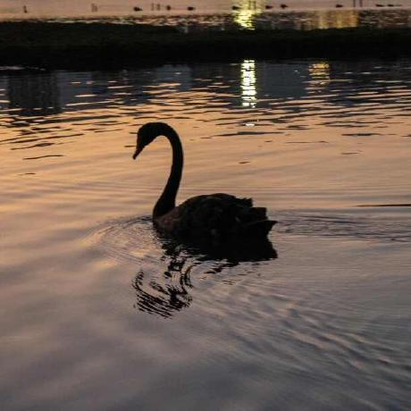

  <table>
    <tr heigth='200'>
        <th width='520' align='left'><em>Weicheng Xia（夏维成）</em></th>
        <th width='280'><a text-decoration='None' href='WeichengXia.github.io' target='_blank'>About Me</a></th>
        <th width='280'>Project</th>
        <th width='280'>Hobbies</th>
        <th width='280'>Honor</th>
        <th width='280'>朋辈导师</th>
    </tr>
    <tr>
        <td align='left' valign='top'>
              
            厦门大学   
            信息与通信工程   
            邮箱：weicheng0911@yeah.net
        </td>
        <td colspan='5' align='left' valign='top'>
            <h2>About Me</h2>
            

              &emsp;大家好！我是夏维成. 
              &emsp;目前是一名信息与通信工程专业大四本科生，就读于<b>厦门大学</b>（翔安校区）。
              目前我已经确定获得了本校推免资格，并获得了本校夏令营优秀营员。很荣幸未来会在本校<b>ATR实验室</b>继续深造。
            

            <h2>News and Updates</h2>
            <ul>
              <li><b>2024年9月</b> 被学院选为2024-2025学年秋季学期电子线路I课程的朋辈导师</li>
              <li><b>2024年9月</b> 以专业成绩第一、综测成绩第二获得本校研究生推免资格</li>
              <li><b>2024年7月</b> 获得厦门大学信息学院2024年优秀大学生夏令营优秀营员</li>
              <li><b>2024年7月</b> 获得浙江大学信息与电子工程学院2024年优秀大学生夏令营优秀营员</li>
            </ul>
            <h2>Last</h2>
            

              &emsp;目前我的个人主页还在建设中，如果你有什么好的想法或者意见，欢迎随时联系我，希望可以建设一个大家喜欢的主页。
              此外，如果大家对我的朋辈导师工作开展有什么建议或者想法，亦或者你有任何疑惑，可以随时联系我。
            

        </td>
    </tr>
  </table>

